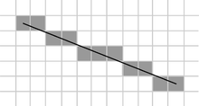
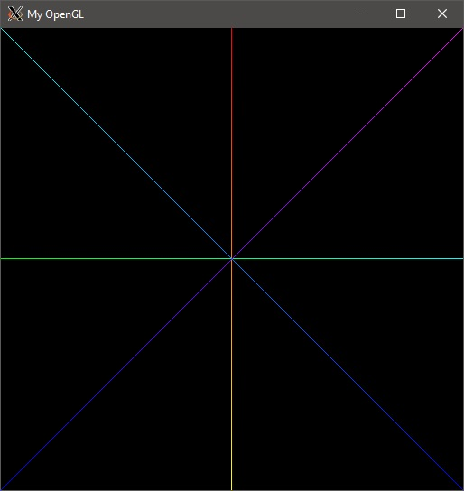
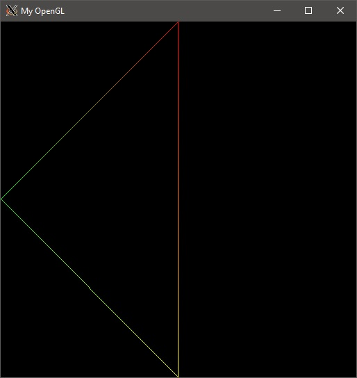
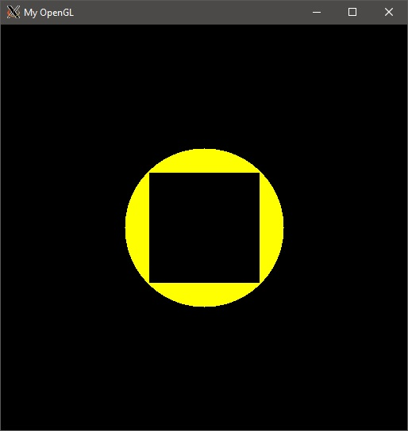
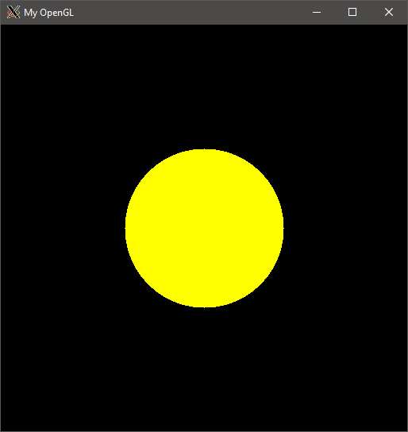
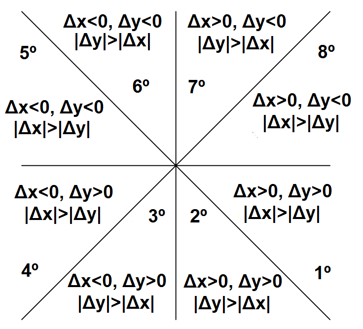

# Familiarização com Algoritmos de Rasterização

## Atividade Proposta
Implementar as funções de desenhos de pontos, retas e triângulos com interpolação linear das cores dos vértices e dos pontos iniciais e finais das retas.

## O que é rasterização
Rasterização, é a tarefa de tomar uma imagem descrita em um imagem vetorial e convertê-la em uma imagem raster (pixels ou pontos) para a saída em vídeo ou impressora.[1]

## Início da rasterização
Para começar a rasterização, deve-se levar em conta a primitiva de uma reta, que é o ponto, e de forma computacional, o pixel é considerado um ponto. Com isso, antes de criar uma reta, a primeira coisa que deve-se criar é um ponto.

### Criando um ponto
Na rasterização, um ponto é composto por suas coordenadas, além disso, possui as informações de cores, o RGBA.
Para isso, criei uma *struct* chamada Pixel, que guarda as informações do pixel:

	struct Pixel
	{
		int pos_x;
		int pos_y;

		unsigned char color[4];
	}
Foi-se usado *unsigned* pois na representação de cores, usamos apenas os valores de 0 a 255, que é o tamanho de um *char* sem sinal.

Com isso, foi-se criado um *enum*, onde ficaria mais fácil indicar com qual elemento do array é referenciado a qual elemento do RGBA;

	enum colors
	{
		RED   = 0,
    	GREEN = 1,
    	BLUE  = 2,
    	ALPHA = 3
	};

Pronto, assim temos toda a estrutura pra começar a criar um pixel, porém, ainda precisamos inicializar-lo, assim, foi feito da seguinte maneira:

	Pixel createPixel(int pos_x, int pos_y, char red, unsigned char green, unsigned char blue, unsigned char alpha, Pixel pixel)
	{
		pixel.pos_x = pos_x; //Coordenada X do Pixel
		pixel.pos_y = pos_y; //Coordenada Y do Pixel

		pixel.color[RED]   = red; //Posição 0 do array representa o red
		pixel.color[GREEN] = green; //Posição 1 do array representa o green
		pixel.color[BLUE]  = blue; //Posição 2 do array representa o blue
		pixel.color[ALPHA] = alpha; //Posição 3 do array representa o alpha

		return pixel;
	}

Considere esse createPixel como um construtor.

Com o pixel criado, nos resta inseri-lo na tela, para que possamos ver. Assim, foi implementado a função putPixel, descrita abaixo:

	void putPixel(Pixel pixel)
	{
		int offset = 4 * pixel.pos_x + 4* pixel.pos_y * IMAGE_WIDTH;

		//Caso o pixel passe do limite da tela, não deve ser exibido
		if(pixel.pos_x < 0 || pixel.pos_y < 0 || pixel.pos_x > IMAGE_HEIGHT || pixel.pos_y > IMAGE_WIDTH)
        	return;

    	//Mostra o pixel na tela
    	FBptr[offset + RED]   = pixel.color[RED];
    	FBptr[offset + GREEN] = pixel.color[GREEN];
    	FBptr[offset + BLUE]  = pixel.color[BLUE];
    	FBptr[offset + ALPHA] = pixel.color[ALPHA];
	}

Mostrando o resultado da função, podemos ver o pixel na tela, como mostra na imagem abaixo:

#### Curiosidades sobre o Pixel/Ponto na tela

Como mostrado na cadeira de computação gráfica, na área da memória, os bytes que correspondem a cada componente do RGBA fica lado a lado, e é interessante ver que as luzes dos pixels na tela também fica lado a lado, veja, por exemplo, um screenshot feito na tela do meu computador:

Deu pra notar que não ficam alinhados? Bem, pra facilitar mais ainda, usei uma câmera com um zoom considerável, pra fazer o "tira-teima":

Agora podemos notar mais ainda a diferença. Interassante ver que parece desalinhado pra nós, ou em outro pixel, porém, todos estão no mesmo pixel. Caso ainda não concorde, veja abaixo o código feito pra fazer este teste:

	Pixel tempPixel;
	for(int i = 0; i < 60; i++) {       // white line
	    tempPixel = createPixel(19, 30+i, 255, 255, 255, 0, tempPixel);
	    putPixel(tempPixel);
	}
	 
	for(int i = 0; i < 256; i++) {
	    int j;
	    for(j = 0; j < 20; j++) {        // all levels of RED
	        tempPixel = createPixel(20+i, 30+j, i, 0, 0, 0, tempPixel);
	        putPixel(tempPixel);
	    }
	     
	    for( ; j < 40; j++) {        // all levels of GREEN
	        tempPixel = createPixel(20+i, 30+j, 0, i, 0, 0, tempPixel);
	        putPixel(tempPixel);
	    }
	 
	    for( ; j < 60; j++) {        // all levels of BLUE
	        tempPixel = createPixel(20+i, 30+j, 0, 0, i, 0, tempPixel);
	        putPixel(tempPixel);
	    }
	}

### Criando uma linha
Com o ponto/pixel criado, podemos fazer uma reta, que é um conjunto de pontos/pixels alinhados. Para isso, utilizaremos a função *drawLine*, e a base do algoritmo se dá da seguinte forma: baseia-se no argumento de que um segmento de reta, ao ser destacado, deve ser contínuo. O algoritmo baseia-se no critério do ponto médio. Onde, para cada coluna de píxeis existem dois píxeis que se encontram mais próximos da reta, um abaixo e outro acima desta. A escolha do pixel a ser destacado, é feita através da distância da interseção da reta com a coluna de píxeis a cada um dos dois píxeis, escolhendo-se então o pixel mais próximo da interseção. Os pixels que compõem um segmento de reta devem ser vizinhos, o que permite visualizar quais pontos numa matriz de base quadriculada que deve ser destacados para atender o grau de inclinação da reta dy/dx. Se o grau do ângulo for de 0º – 45º, nunca poderá destacar 2 pixels na mesma coluna, caso seja de 45º – 90º, nunca poderá destacar 2 pixels na mesma linha. Em outras palavras, a aproximação é feita estipulando um ponto médio, onde o pixel que mais se aproxima da reta será o próximo destacado.[2]

Como exemplo, veja a imagem abaixo:

Esta imagem representa de como a linha fica quando a reta possui 22º

Devido a extensão do código, dividirei em duas partes a explicação, mas antes disso, segue a base da função:

    int delta_x = pixelFinal.pos_x - pixelInitial.pos_x; //calculo de delta
    int delta_y = pixelFinal.pos_y - pixelInitial.pos_y; //calculo de delta
    int d, incDPos, incDNeg; //variaveis
     
    if(delta_x < 0) {     
        std::swap(pixelInitial, pixelFinal) //swap caso a ordem seja o contrário
        delta_x = -delta_x;
        delta_y = -delta_y;
    }

     
    int dySig = (delta_y < 0)?(-1):1; //alteração do delta Y
     
    Pixel pixelAuxiliar = pixelInitial; //Pixel auxiliar
    putPixel(pixelInitial); //Impressao do primeiro pixel

Com isso, vamos a explicação por coeficiente angular:

#### Para todo coeficiente angular menor ou igual a 1 (|m| <= 1)

	if( dySig*delta_y <= delta_x ) { //|m| <= 1
        if(delta_y < 0) {
            d = 2*delta_y + delta_x;            // d_first
            while(pixelAuxiliar.pos_x < pixelFinal.pos_x) { //for each x
                if(d < 0) { // midpoint ABOVE the line
                    d += 2*(delta_y + delta_x);
                    pixelAuxiliar.pos_x++;
                    pixelAuxiliar.pos_y--;
                } else { // midpoint BELOW the line
                    d += 2*delta_y;
                    pixelAuxiliar.pos_x++;
                }
                for(int i = RED; i <= ALPHA; i++) { //for each component, interpolate
                    pixelAuxiliar.color[i] = (unsigned char)(pixelInitial.color[i] + (pixelAuxiliar.pos_x - pixelInitial.pos_x)*(pixelFinal.color[i] - pixelInitial.color[i])/delta_x);
                }
                putPixel(pixelAuxiliar);
            }
        } else {
            d = 2*delta_y - delta_x; //d_first
            while(pixelAuxiliar.pos_x < pixelFinal.pos_x) { //for each x
                if(d < 0) { //midpoint BELOW the line
                    d += 2*delta_y;
                    pixelAuxiliar.pos_x++;
                } else { //midpoint ABOVE the line
                    d += 2*(delta_y - delta_x);
                    pixelAuxiliar.pos_x++;
                    pixelAuxiliar.pos_y++;
                }
                for(int i = RED; i <= ALPHA; i++) { //for each component, interpolate
                    pixelAuxiliar.color[i] = (unsigned char)(pixelInitial.color[i] + (pixelAuxiliar.pos_x - pixelInitial.pos_x)*(pixelFinal.color[i] - pixelInitial.color[i])/delta_x);
                }
                putPixel(pixelAuxiliar);
            }
        }
    }

O código em si possui comentários explicando a representação de cada parte

#### Para todo coeficiente angular maior que 1 (|m| > 1)

	else { //|m| > 1        
        if(delta_y < 0) {
            d = delta_y + 2*delta_x; //d_first
            while( pixelAuxiliar.pos_y > pixelFinal.pos_y ) { //for each y
                if(d < 0) { //midpoint ABOVE the line
                    d += 2*delta_x;
                    pixelAuxiliar.pos_y--;
                } else { //midpoint BELOW the line
                    d += 2*(delta_y + delta_x);
                    pixelAuxiliar.pos_x++;
                    pixelAuxiliar.pos_y--;
                }
                for(int i = RED; i <= ALPHA; i++) { //for each component, interpolate
                    pixelAuxiliar.color[i] = (unsigned char)(pixelInitial.color[i] + (pixelAuxiliar.pos_y - pixelInitial.pos_y)*(pixelFinal.color[i] - pixelInitial.color[i])/delta_y);
                }
                putPixel(pixelAuxiliar);
            }
        } else {
            d = delta_y -2*delta_x; //d_first
            while( pixelAuxiliar.pos_y < pixelFinal.pos_y ) { //for each y
                if(d < 0) { //midpoint BELOW the line
                    d += 2*(delta_y - delta_x);
                    pixelAuxiliar.pos_x++;
                    pixelAuxiliar.pos_y++;
                } else { //midpoint ABOVE the line
                    d += -2*delta_x;
                    pixelAuxiliar.pos_y++;
                }
                for(int i = RED; i <= ALPHA; i++) { //for each component, interpolate
                    pixelAuxiliar.color[i] = (unsigned char)(pixelInitial.color[i] + (pixelAuxiliar.pos_y - pixelInitial.pos_y)*(pixelFinal.color[i] - pixelInitial.color[i])/delta_y);
                }
                putPixel(pixelAuxiliar);
            }
        }
    }

Após tudo isso, faz-se a impressão do último pixel:

	putPixel(pixelFinal);

Com isso, este é o nosso resultado final:

### Criando triângulos
Triângulo nada mais é que 3 vértices ligadas, então, apenas devemos ter 3 pixels e liga-los usando o drawLine:

	void drawTriangle(Pixel pixelFinal, Pixel p2, Pixel p3)
	{
	    drawLine(pixelFinal, p2);
	    drawLine(p2, p3);
	    drawLine(p3, pixelFinal);
	}

Assim, segue uma imagem de exemplo de como ficou:

### Interpolação nas retas

Apesar de nas imagens já mostrar com as retas interpoladas, eu quis fazer essa seção pra explicar melhor como foi que funcionou.

Interpolação é "o método que permite construir um novo conjunto de dados a partir de um conjunto discreto de dados pontuais previamente conhecidos. (...) Através da interpolação, pode-se construir uma função que aproximadamente se 'encaixe' nestes dados pontuais, conferindo-lhes, então, a continuidade desejada"[3].

Para isso, foi usado o seguinte código:

	for(int i = RED; i <= ALPHA; i++) {    // for each component, interpolate
		pixelAuxiliar.color[i] = (unsigned char)(pixelInitial.color[i] + (pixelAuxiliar.pos_x - pixelInitial.pos_x)*(pixelFinal.color[i] - pixelInitial.color[i])/delta_x);
	}

Ela usa os dois pixels que definem a linha (extremidades), e o pixel auxiliar que está sendo processado dentro da função DrawLine.

## Extras

Com a sobra de tempo, resolvi fazer um extra: Criar um círculo e dentro dele ser preenchido.

Para começar, pensei que a melhor forma de preencher era: fazendo linha a linha dele, começando de uma extremidade e indo até outra. Porém, isso demoraria um pouco mais do que planejado... Com isso, pensei em: faço 4 pontos cardeais do circulo até se encontrarem, depois, preencho o restante. Como assim? Veja abaixo o código:

	float sinus = 0.70710678118;
    Pixel pixelAuxiliar;

    //This is the distance on the axis from sin(90) to sin(45). 
    int range = radius/(2*sinus);
    for(int i = radius ; i >= range ; --i)
    {
        int j = sqrt(radius*radius - i*i);
        for(int k = -j ; k <= j ; k++)
        {
            //We draw all the 4 sides at the same time.
            pixelAuxiliar = createPixel(centerPos.pos_x - k, centerPos.pos_y + i, centerPos.color[RED], centerPos.color[GREEN], centerPos.color[BLUE], centerPos.color[ALPHA], pixelAuxiliar);
            putPixel(pixelAuxiliar);
            pixelAuxiliar = createPixel(centerPos.pos_x - k, centerPos.pos_y - i, centerPos.color[RED], centerPos.color[GREEN], centerPos.color[BLUE], centerPos.color[ALPHA], pixelAuxiliar);
            putPixel(pixelAuxiliar);
            pixelAuxiliar = createPixel(centerPos.pos_x + i, centerPos.pos_y + k, centerPos.color[RED], centerPos.color[GREEN], centerPos.color[BLUE], centerPos.color[ALPHA], pixelAuxiliar);
            putPixel(pixelAuxiliar);
            pixelAuxiliar = createPixel(centerPos.pos_x - i, centerPos.pos_y - k, centerPos.color[RED], centerPos.color[GREEN], centerPos.color[BLUE], centerPos.color[ALPHA], pixelAuxiliar);
            putPixel(pixelAuxiliar);
        }
    }

Como no comentário, esse trecho mais desenhar os 4 "lados" de um circulo ao mesmo tempo, executando somente esse trecho, fica a seguinte imagem:

Assim, resta-nos o mais fácil, que é desenhar o quadrado dentro. Com isso, fiz o seguinte código:

	//To fill the circle we draw the circumscribed square.
    range = radius*sinus;
    for(int i = centerPos.pos_x - range + 1 ; i < centerPos.pos_x + range ; i++)
    {
        for(int j = centerPos.pos_y - range + 1 ; j < centerPos.pos_y + range ; j++)
        {
            pixelAuxiliar = createPixel(i, j, centerPos.color[RED], centerPos.color[GREEN], centerPos.color[BLUE], centerPos.color[ALPHA], pixelAuxiliar);
            putPixel(pixelAuxiliar);
        }
    }

Com isso, todo o círculo está preenchido. A chamada da função foi o seguinte:

	drawFilledCircle(Pixel centerPos, int radius);

## Dificuldades Encontradas

Minha maior dificuldade foi na rasterização de linha nos octantes 3,4,7,8, visto que por algum motivo da reflexão, não estava sendo impresso, após refazer tudo com mais calma e me basear na imagem abaixo, consegui fazer corretamente.

## Referências
[1] https://pt.wikipedia.org/wiki/Rasteriza%C3%A7%C3%A3o

[2] http://www.univasf.edu.br/~jorge.cavalcanti/comput_graf04_prim_graficas2.pdf

[3] https://pt.wikipedia.org/wiki/Interpola%C3%A7%C3%A3o