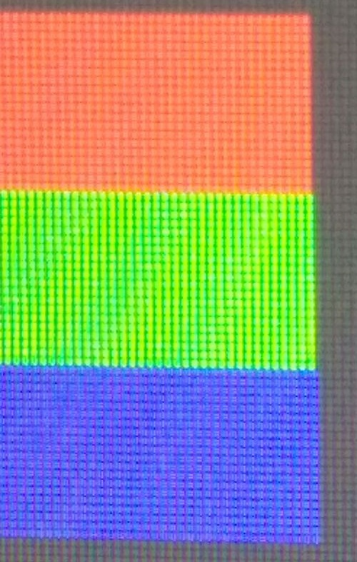

# Familiarização com Algoritmos de Rasterização

## Atividade Proposta
Implementar as fuñções de desenhos de pontos, retas e triângulos com interpolação linear das cores dos vértices e dos pontos iniciais e finais das retas.

## O que é rasterização
Rasterização, é a tarefa de tomar uma imagem descrita em um imagem vetorial e convertê-la em uma imagem raster (pixels ou pontos) para a saída em vídeo ou impressora.¹

## Início da rasterização
Para começar a rasterização, deve-se levar em conta a primitiva de uma reta, que é o ponto, e de forma computacional, o pixel é considerado um ponto. Com isso, antes de criar uma reta, a primeira coisa que deve-se criar é um ponto.

### Criando um ponto
Na rasterização, um ponto é composto por suas coordenadas, além disso, possui as informações de cores, o RGBA.
Para isso, criei uma *struct* chamada Pixel, que guarda as informações do pixel:

	struct Pixel
	{
		int pos_x;
		int pos_y;

		unsigned char color[4];
	}
Foi-se usado *unsigned* pois na representação de cores, usamos apenas os valores de 0 a 255, que é o tamanho de um *char* sem sinal.

Com isso, foi-se criado um *enum*, onde ficaria mais fácil indicar com qual elemento do array é referenciado a qual elemento do RGBA;

	enum colors
	{
		RED   = 0,
    	GREEN = 1,
    	BLUE  = 2,
    	ALPHA = 3
	};

Pronto, assim temos toda a estrutura pra começar a criar um pixel, porém, ainda precisamos inicializar-lo, assim, foi feito da seguinte maneira:

	Pixel createPixel(int pos_x, int pos_y, char red, unsigned char green, unsigned char blue, unsigned char alpha, Pixel pixel)
	{
		pixel.pos_x = pos_x; //Coordenada X do Pixel
		pixel.pos_y = pos_y; //Coordenada Y do Pixel

		pixel.color[RED]   = red; //Posição 0 do array representa o red
		pixel.color[GREEN] = green; //Posição 1 do array representa o green
		pixel.color[BLUE]  = blue; //Posição 2 do array representa o blue
		pixel.color[ALPHA] = alpha; //Posição 3 do array representa o alpha

		return pixel;
	}

Considere esse createPixel como um construtor.

Com o pixel criado, nos resta inseri-lo na tela, para que possamos ver. Assim, foi implementado a função putPixel, descrita abaixo:

	void putPixel(Pixel pixel)
	{
		int offset = 4 * pixel.pos_x + 4* pixel.pos_y * IMAGE_WIDTH;

		//Caso o pixel passe do limite da tela, não deve ser exibido
		if(pixel.pos_x < 0 || pixel.pos_y < 0 || pixel.pos_x > IMAGE_HEIGHT || pixel.pos_y > IMAGE_WIDTH)
        	return;

    	//Mostra o pixel na tela
    	FBptr[offset + RED]   = pixel.color[RED];
    	FBptr[offset + GREEN] = pixel.color[GREEN];
    	FBptr[offset + BLUE]  = pixel.color[BLUE];
    	FBptr[offset + ALPHA] = pixel.color[ALPHA];
	}

Mostrando o resultado da função, podemos ver o pixel na tela, como mostra na imagem abaixo:

#### Curiosidades sobre o Pixel/Ponto na tela

Como mostrado na cadeira de computação gráfica, na área da memória, os bytes que correspondem a cada componente do RGBA fica lado a lado, e é interessante ver que as luzes dos pixels na tela também fica lado a lado, veja, por exemplo, um screenshot feito na tela do meu computador:

Deu pra notar que não ficam alinhados? Bem, pra facilitar mais ainda, usei uma câmera com um zoom considerável, pra fazer o "tira-teima":

Agora podemos notar mais ainda a diferença. Interassante ver que parece desalinhado pra nós, ou em outro pixel, porém, todos estão no mesmo pixel. Caso ainda não concorde, veja abaixo o código feito pra fazer este teste:

	Pixel tempPixel;
	for(int i = 0; i < 60; i++) {       // white line
	    tempPixel = createPixel(19, 30+i, 255, 255, 255, 0, tempPixel);
	    putPixel(tempPixel);
	}
	 
	for(int i = 0; i < 256; i++) {
	    int j;
	    for(j = 0; j < 20; j++) {        // all levels of RED
	        tempPixel = createPixel(20+i, 30+j, i, 0, 0, 0, tempPixel);
	        putPixel(tempPixel);
	    }
	     
	    for( ; j < 40; j++) {        // all levels of GREEN
	        tempPixel = createPixel(20+i, 30+j, 0, i, 0, 0, tempPixel);
	        putPixel(tempPixel);
	    }
	 
	    for( ; j < 60; j++) {        // all levels of BLUE
	        tempPixel = createPixel(20+i, 30+j, 0, 0, i, 0, tempPixel);
	        putPixel(tempPixel);
	    }
	}

## Referências
[1] https://pt.wikipedia.org/wiki/Rasteriza%C3%A7%C3%A3o