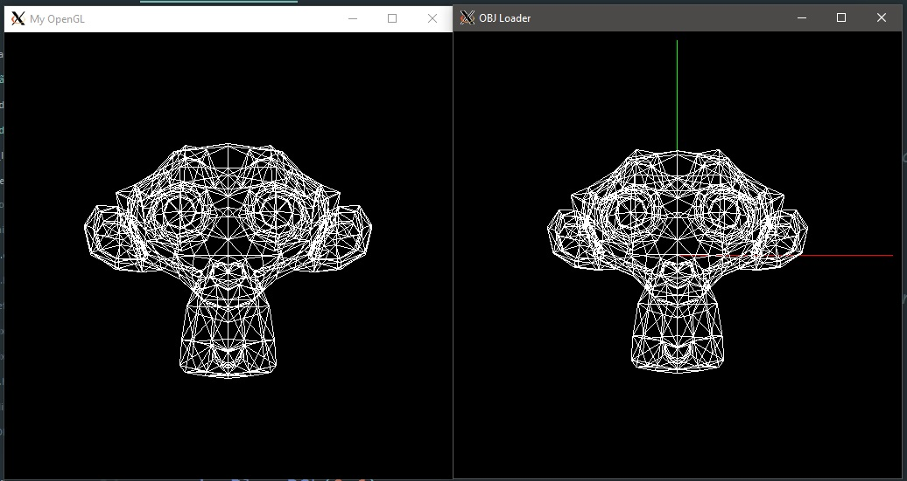

# Passo a Passo do Pipeline Gráfico

## Atividade Proposta
O objetivo deste trabalho é familiarizar os alunos com a estrutura e o funcionamento do pipeline gráfico através da implementação de um pipeline completo, capaz de transformar vértices descritos no espaço do objeto em primitivas rasterizadas no espaço de tela.[1] 

## O que é um Pipeline Gráfico
Pipeline Gráfico é uma sequência de passos para transformar a descrição matemática/geométrica de uma cena em uma imagem discreta na tela.[2] Ou seja, passos na computação gráfica capaz de transformar um objeto de 3D para que seja mostrado na tela, em 2D.

## Sequência de um Pipeline Gráfico

O pipeline é composto por 6 principais etapas, que são:

- Espaço do Objeto
- Espaço do Universo
- Espaço da Câmera
- Espaço de Recorte
- Espaço Canônico
- Espaço de Tela

Nesta postagem eu irei falar um pouco da passagem entre cada etapa, referenciando o trecho do código a cada matriz ou etapa.

### Espaço do Objeto para Espaço do Universo
<p align="center">
	<br>
	
	<h5 align="center">Figura 1 - Representação da passagem entre os espaços</h5>
	<br>
</p>

Esta etapa leva os objetos do espaço do objeto para o espaço do universo, fazendo isso da seguinte maneira: os vértices no espaço do objeto são transformados através de multiplicações do mesmo pela matriz de modelagem, onde tal matriz é composta por uma sequência de transformações geométricas que se deseja aplicar, resultando na matriz de modelagem, ou matriz model.

Para criar esse produto de matrizes que gera a matriz model, são utilizadas as seguintes matrizes:

#### Matriz de Escala
```C++
void scaleGL(double x, double y, double z)
{
    Matrix scale(4, 4);
    
    scale.loadIdentity();
    
    scale.setValue(0, 0, x);
    scale.setValue(1, 1, y);
    scale.setValue(2, 2, z);
    
    matrix_model.mult(matrix_model, scale);
}
```

#### Matriz Shear
```C++
void shearGL(double x, double y, double z)
{
    Matrix shear(4, 4);
    shear.loadIdentity();

    shear.setValue(0, 1, x);
    shear.setValue(0, 2, x);

    shear.setValue(1, 0, y);
    shear.setValue(1, 2, y);

    shear.setValue(2, 0, z);
    shear.setValue(2, 1, z);

    matrix_model.mult(matrix_model, shear);
}
```

#### Matriz de Rotação
```C++
void rotateGL(double angle, double x, double y, double z)
{
    Matrix rotate(4, 4);
    
    rotate.loadIdentity();
    
    if(x > 0.0) {
        rotate.setValue(1, 1, cos(angle));
        rotate.setValue(1, 2, -sin(angle));
        rotate.setValue(2, 1, sin(angle));
        rotate.setValue(2, 2, cos(angle));
    }
    
    if(y > 0.0) {
        rotate.setValue(0, 0, cos(angle));
        rotate.setValue(0, 2, sin(angle));
        rotate.setValue(2, 0, -sin(angle));
        rotate.setValue(2, 2, cos(angle));
    }
    
    if(z > 0.0) {
        rotate.setValue(0, 0, cos(angle));
        rotate.setValue(0, 1, -sin(angle));
        rotate.setValue(1, 0, sin(angle));
        rotate.setValue(1, 1, cos(angle));
    }
    
    matrix_model.mult(matrix_model, rotate);
}
```

Com as matrizes, podemos fazer o seguinte:
```C++
vertice.mult(matrix_model, vertice)
```

Como dito anteriormente, a matriz model é o produto das matrizes de transformações geométricas, então, basta multiplicar essa matriz pelos vértices do objeto e essa etapa estará feita.

### Espaço do Universo para Espaço da Câmera
<p align="center">
	<br>
	
	<h5 align="center">Figura 2 - Representação da passagem entre os espaços</h5>
	<br>
</p>

Aqui é definido como a cena será vista, então, faz-se necessário configurar a câmera. A câmera possui 3 dados importantes que devem ser descritos:

- Posição da Câmera: Local onde ela se encontra
- Direction: Local para onde a câmera está "olhando"
- Up: Fixa a câmera no eixo determinado

Assim, é criado o código que representa a Criação da Câmera:

#### Criação da Câmera - Matriz View
```C++
void createCamera(double pos_x, double pos_y, double pos_z, 
    double lookat_x, double lookat_y, double lookat_z, 
    double up_x, double up_y, double up_z)
{
    Vector x_cam(3, 1);
    Vector y_cam(3, 1);
    Vector z_cam(3, 1);

    Matrix Bt(4, 4);
    Matrix T(4, 4);
    
    Vector aux(3, 1);
    Vector up(3, 1);

    double vec_pl[] = {pos_x - lookat_x, pos_y - lookat_y, pos_z - lookat_z};
    double vec_up[]  = {up_x, up_y, up_z};
    
    aux.setValues(vec_pl);
    up.setValues(vec_up);
    
    z_cam.div(aux, norm(&aux));

    cross(&up, &z_cam, &aux);
    
    x_cam.div(aux, norm(&aux));
    
    cross(&z_cam, &x_cam, &aux);
    y_cam.div(aux, norm(&aux));
    
    double bt_mtx[] = {
        x_cam.getValue(0, 0), x_cam.getValue(1, 0), x_cam.getValue(2, 0), 0,
        y_cam.getValue(0, 0), y_cam.getValue(1, 0), y_cam.getValue(2, 0), 0,
        z_cam.getValue(0, 0), z_cam.getValue(1, 0), z_cam.getValue(2, 0), 0,
                0,                    0,                    0,            1
    };
    
    Bt.setValues(bt_mtx);
    
    T.loadIdentity();
    T.setValue(0, 3, -pos_x);
    T.setValue(1, 3, -pos_y);
    T.setValue(2, 3, -pos_z);
    
    matrix_view.loadIdentity();

    matrix_view.mult(Bt, T);
}
```

Abaixo, é feito a parte que corresponde a essa etapa, o vertice, que agora possui os dados da etapa anterior, é multiplicado com a matriz view, criada para ser usada nessa etapa:
```C++
vertice.mult(matrix_view, vertice);
```

### Espaço do Câmera para Espaço de Recorte
Nesta etapa, os pontos que estão no espaço da câmera são movidos para o espaço de recorte. É interessante ressaltar que é nessa etapa onde ocorre a distorção perspectiva - objetos mais próximos do view plane aparentam ser maiores do que objetos que estão mais distantes.

Aqui, a matriz de projeção é criada/sofre alterações para que ocorra a distorção perspectiva.

Assim, é criado o código que representa a Matriz de Projeção:

#### Criação do View Plane - Matriz Projection
```C++
void viewPlaneDGL(double dist)
{
    double d = dist;
    
    matrix_projection.setValue(2, 3, d);
    matrix_projection.setValue(3, 2, (-1) / d);
    matrix_projection.setValue(3, 3, 0);
}
```

Com a matriz de projeção criada, multiplica-se agora com resultado da etapa anterior, da seguinte forma:
```C++
vertice.mult(matrix_projection, vertice);
```

### Espaço de Recorte para Espaço Canônico
Aqui ocorre a homogeneização, que no caso, significa dividir todos os componentes do vértice pela sua coordenada homogênea.
Então, para fazer a divisão, fazemos o seguinte:
```C++
vertice.div(vertice, vertice.getValue(3, 0));
```

Como pode notar no código, é pego o último elemento, que é a coordenada homogênea, e assim, dividimos pelo resultado da etapa anterior, terminando essa etapa.

### Espaço Canônico para Espaço da Tela
Aqui é utilizado o viewport, onde aqui os vértices do espaço canônico é mapeado para o espaço da tela. Para isso ocorrer, deve-se lembrar que os valores são arredondados, pois a tela possui apenas coordenadas inteiras.

Então, eis o código que representa a Matriz Viewport:

#### Criação da Tela - Matriz Viewport
```C++
void viewportGL(int x, int y, size_t width, size_t height)
{
    Matrix S1(4, 4);
    Matrix S2(4, 4);
    Matrix T(4, 4);

    S1.loadIdentity();
    S2.loadIdentity();
    T.loadIdentity();
    
    S1.setValue(1, 1, -1);
    
    S2.setValue(0, 0, (width - 1) / 2.0f);
    S2.setValue(1, 1, (height - 1) / 2.0f);
    
    T.setValue(0, 3, 1);
    T.setValue(1, 3, 1);
    
    matrix_viewport.loadIdentity();
    
    matrix_viewport.mult(T, S1);
    matrix_viewport.mult(S2, matrix_viewport);
}
```

Com a viewport criada, ocorre a multiplicação da etapa anterior com a viewport:
```C++
vertice.mult(matrix_viewport, vertice);
```

## Criando um Pipeline Gráfico
Esta parte consiste em mostrar como foi juntar os trechos anteriores em apenas uma função, comentando qual etapa corresponde a qual linha do código. Para isso, veja o código a seguir:
```C++
Point createPipeline(double x, double y, double z)
{
	//Vertices no espaço do objeto
    double vert[] = {x, y, z, 1};
    //Matriz que representa os vertices
    Matrix vertice(4, 1);
    //Insere os vertices obtidos na matriz
    vertice.setValues(vert);

    vertice.mult(matrix_model, vertice); //Espaço do Objeto para Espaço do Universo
    vertice.mult(matrix_view, vertice); //Espaço do Universo para Espaço da Câmera
    vertice.mult(matrix_projection, vertice); //Espaço da Câmera para Espaço de Recorte
    vertice.div(vertice, vertice.getValue(3, 0)); //Espaço de Recorte para Espaço Canônico
    vertice.mult(matrix_viewport, vertice); //Espaço Canônico para Espaço da Tela

    //Obtem o valor das coordenadas no espaço de tela
    Point p = {.x = (int)vertice.getValue(0, 0), .y = (int)vertice.getValue(1, 0)};
    
    //Retorna o ponto com as coordenadas do espaço de tela
    return p;
}
```

## Utilizando o Código na main
```C++
void MyGlDraw(void)
{
	//Inicializa o Pipeline, carregando a identidade nas matrizes básicas
	init();
	
	//Cria a câmera
	createCamera(
		0.0f, 0.0f, 5.0f,	// posição da câmera
		0.0f, 0.0f, 0.0f,	// ponto para o qual a camera está olhando
		0.0f, 1.0f, 0.0f	// vetor "up"
	);
	
	//Construção da Janela de Projeção
	viewportGL(0, 0, IMAGE_WIDTH, IMAGE_HEIGHT);
	
	//Distância d do View Plane
	viewPlaneDGL(2.6);

	//Matriz de Rotação
	rotateGL(angle, 0.0f, 1.0f, 0.0f);
	//Velocidade da rotação uniforme
	angle += 0.01f;
	
	//Limpa o Color Buffer
	memset(FBptr, 0, IMAGE_WIDTH * IMAGE_HEIGHT * 4);
	
	//Cria os 3 vértices do triângulo
	Pixel pixel[3];

	//Cores do objeto a ser desenhado na tela
	unsigned char red   = 255;
	unsigned char green = 255;
	unsigned char blue  = 255;
	unsigned char alpha = 0;
	
	for(int f = 0; f < objData->faceCount; f++) {
		obj_face* obj = objData->faceList[f];
		
		for(int i = 0; i < 3; i++) {
			//Faz uma séria de multiplicações de matrizes para obter os pontos na coordenada de tela
			Point p = createPipeline(
				objData->vertexList[obj->vertex_index[i]]->e[0],
				objData->vertexList[obj->vertex_index[i]]->e[1],
				objData->vertexList[obj->vertex_index[i]]->e[2]
			);
			
			//Com os pontos de coordenada de tela obtidos, cria os pixels que serão os vértices dos triângulos
			pixel[i] = createPixel(p.x, p.y, red, green, blue, alpha, pixel[i]);
		}
		
		//Desenha o triângulo ligando os seus vértices
		//Utiliza o bresenham criado na atividade anterior
		drawTriangle(pixel[0], pixel[1], pixel[2]);
	}
}
```

Esta função usa todo o código criado tanto desta atividade como da atividade anterior, ainda mostra a sequência para que o código funcione na main.

## Resultados
### Comparação com o OBJ Loader disponibilizado
Comparando com o loader disponibilizado, dava pra notar que tinha que ser alterado o valor d do *view plane* para ficar o mais parecido possível, com isso, abaixo está a imagem de comparação com d = 2.6:
<p align="center">
    <br>
    
    <h5 align="center">Figura 3 - Comparação entre o OBJ Loader e "meu OpenGL"</h5>
    <br>
</p>

### Vídeo do Funcionamento
Abaixo coloquei um vídeo no youtube mostrando o funcionamento tanto para o obj fornecido, como para um obj de um icosaedro.

[Clique aqui para ver o vídeo](http://www.youtube.com/watch?v=YobbewFW5NU)

**Observação**:
O vídeo dá umas travadas pois está rodando o windows 10 e dois bash do linux, assim, ficando um pouco pesado no momento da

## Dificuldades Encontradas
Uma das dificuldades encontradas foi encontrar uma forma de como o color buffer poderia ser limpo sem usar funções do OpenGL, assim, ficando o erro da imagem abaixo:

<p align="center">
	<br>
	
	<h5 align="center">Figura 4 - Imagem sem limpar o color buffer</h5>
	<br>
</p>

Para corrigir isso, notei que poderia usar o **memset**[3], da seguinte maneira:
	
	memset(FBptr, 0, IMAGE_WIDTH * IMAGE_HEIGHT * 4)

Com isso, o FBprt foi preenchido com 0, no tamanho da conta feito pela tela, ou seja, a tela foi limpa com a cor preta a cada frame.

## Melhorias
Uma das melhorias que tenho em mente no momento seria lançar exceções, visto que há algumas contas com matrizes que poderia causar alguns erros, se não feito corretamente, junto com as operações matemáticas necessárias.
Além disso, melhorias no loader, visto que dependendo do tamanho do OBJ, não chegava nem a carregar ou causava algum erro quando carregava (por exemplo, a tela ficava totalmente preta).

## Referências

[1] Definição do Trabalho Proposto para cadeira de ICG, Professor Christian A. P.

[2] Notas de Aula do Professor Christian A. P.

[2] http://en.cppreference.com/w/cpp/string/byte/memset