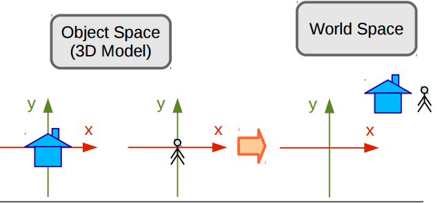

# Passo a Passo do Pipeline Gráfico

## Atividade Proposta
O objetivo deste trabalho é familiarizar os alunos com a estrutura e o funcionamento do pipeline gráfico através da implementação de um pipeline completo, capaz de transformar vértices descritos no espaço do objeto em primitivas rasterizadas no espaço de tela.[1] 

## O que é um Pipeline Gráfico
Pipeline Gráfico é uma sequência de passos para transformar a descrição matemática/geométrica de uma cena em uma imagem discreta na tela.[2] Ou seja, passos na computação gráfica capaz de transformar um objeto de 3D para que seja mostrado na tela, em 2D.

O pipeline é composto por 6 principais etapas, que são:

- Espaço do Objeto
- Espaço do Universo
- Espaço da Câmera
- Espaço de Recorte
- Espaço Canônico
- Espaço de Tela

Nesta postagem eu irei falar um pouco da passagem entre cada etapa, mostrando diretamente no código o que foi feito (não irei repetir o que foi dado em sala de aula).

### Espaço do Objeto para Espaço do Universo
<p align="center">
	<br>
	
	<h5 align="center">Figura 1 - Representação da passagem entre os espaços</h5>
	<br>
</p>

Esta etapa leva os objetos do espaço do objeto para o espaço do universo, fazendo isso da seguinte maneira: os vértices no espaço do objeto são transformados através de multiplicações do mesmo pela matriz de modelagem, onde tal matriz é composta por uma sequência de transformações geométricas que se deseja aplicar, resultando na matriz de modelagem, ou matrix model.

Para criar essa matriz, foram implementados os métodos abaixo.

#### Matriz de Escala
```C++
void scaleGL(double x, double y, double z)
{
    Matrix scale(4, 4);
    
    scale.loadIdentity();
    
    scale.setValue(0, 0, x);
    scale.setValue(1, 1, y);
    scale.setValue(2, 2, z);
    
    matrix_model.mult(matrix_model, scale);
}
```

#### Matriz Shear
```C++
void shearGL(double x, double y, double z)
{
    Matrix shear(4, 4);
    shear.loadIdentity();

    shear.setValue(0, 1, x);
    shear.setValue(0, 2, x);

    shear.setValue(1, 0, y);
    shear.setValue(1, 2, y);

    shear.setValue(2, 0, z);
    shear.setValue(2, 1, z);

    matrix_model.mult(matrix_model, shear);
}
```

#### Matriz de Rotação
```C++
void rotateGL(double angle, double x, double y, double z)
{
    Matrix rotate(4, 4);
    
    rotate.loadIdentity();
    
    if(x > 0.0) {
        rotate.setValue(1, 1, cos(angle));
        rotate.setValue(1, 2, -sin(angle));
        rotate.setValue(2, 1, sin(angle));
        rotate.setValue(2, 2, cos(angle));
    }
    
    if(y > 0.0) {
        rotate.setValue(0, 0, cos(angle));
        rotate.setValue(0, 2, sin(angle));
        rotate.setValue(2, 0, -sin(angle));
        rotate.setValue(2, 2, cos(angle));
    }
    
    if(z > 0.0) {
        rotate.setValue(0, 0, cos(angle));
        rotate.setValue(0, 1, -sin(angle));
        rotate.setValue(1, 0, sin(angle));
        rotate.setValue(1, 1, cos(angle));
    }
    
    matrix_model.mult(matrix_model, rotate);
}
```

#### Matriz de Translação
```C++
void translateGL(double dx, double dy, double dz)
{
    Matrix translate(4, 4);
    
    translate.loadIdentity();
    
    translate.setValue(0, 3, dx);
    translate.setValue(1, 3, dy);
    translate.setValue(2, 3, dz);
    
    matrix_model.mult(matrix_model, translate);
}
```

Como pode observar, no final de cada transformação, a matriz é multiplicada pela matriz model, assim, fazendo a composição de transformações necessárias para a mudança de espaços.

### Espaço do Universo para Espaço da Câmera
<p align="center">
	<br>
	
	<h5 align="center">Figura 2 - Representação da passagem entre os espaços</h5>
	<br>
</p>

Aqui é definido como a cena será vista, então, faz-se necessário configurar a câmera. A câmera possui 3 dados importantes que devem ser descritos:

- Posição da Câmera: Local onde ela se encontra
- Direction: Local para onde a câmera está "olhando"
- Up: Fixa a câmera no eixo determinado

Assim, o código para a criação da câmera, junto com a matriz de visualização, fica da seguinte maneira:
```C++
void createCamera(double pos_x, double pos_y, double pos_z, 
    double lookat_x, double lookat_y, double lookat_z, 
    double up_x, double up_y, double up_z)
{
    Vector x_cam(3, 1);
    Vector y_cam(3, 1);
    Vector z_cam(3, 1);

    Matrix Bt(4, 4);
    Matrix T(4, 4);
    
    Vector aux(3, 1);
    Vector up(3, 1);

    double vec_pl[] = {pos_x - lookat_x, pos_y - lookat_y, pos_z - lookat_z};
    double vec_up[]  = {up_x, up_y, up_z};
    
    aux.setValues(vec_pl);
    up.setValues(vec_up);
    
    z_cam.div(aux, norm(&aux));

    cross(&up, &z_cam, &aux);
    
    x_cam.div(aux, norm(&aux));
    
    cross(&z_cam, &x_cam, &aux);
    y_cam.div(aux, norm(&aux));
    
    double bt_mtx[] = {
        x_cam.getValue(0, 0), x_cam.getValue(1, 0), x_cam.getValue(2, 0), 0,
        y_cam.getValue(0, 0), y_cam.getValue(1, 0), y_cam.getValue(2, 0), 0,
        z_cam.getValue(0, 0), z_cam.getValue(1, 0), z_cam.getValue(2, 0), 0,
                0,                    0,                    0,            1
    };
    
    Bt.setValues(bt_mtx);
    
    T.loadIdentity();
    T.setValue(0, 3, -pos_x);
    T.setValue(1, 3, -pos_y);
    T.setValue(2, 3, -pos_z);
    
    matrix_view.loadIdentity();

    matrix_view.mult(Bt, T);
}
```


## Dificuldades Encontradas
Uma das dificuldades encontradas foi encontrar uma forma de como o color buffer poderia ser limpo sem usar funções do OpenGL, assim, ficando o erro da imagem abaixo:

<p align="center">
	<br>
	
	<h5 align="center">Imagem sem limpar o color buffer</h5>
	<br>
</p>

Para corrigir isso, notei que poderia usar o **memset**[3], da seguinte maneira:
	
	memset(FBptr, 0, IMAGE_WIDTH * IMAGE_HEIGHT * 4)

Com isso, o FBprt foi preenchido com 0, no tamanho da conta feito pela tela, ou seja, a tela foi limpa com a cor preta a cada frame.

## Referências

[1] Definição do Trabalho Proposto para cadeira de ICG, Professor Christian A. P.

[2] Notas de Aula do Professor Christian A. P.

[2] http://en.cppreference.com/w/cpp/string/byte/memset